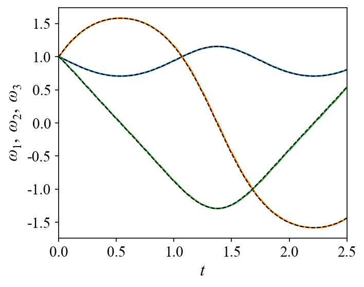

Euler Rigid-Body System
=======================

Problem Setup
-------------

This example demonstrates how to solve a user-defined Euler rigid-body
system using the ADALib forward solver.

For torque-free rigid-body rotation, the angular velocities
:math:`\omega_1`, :math:`\omega_2`, and :math:`\omega_3` satisfy

.. math::

   \frac{d\omega_1}{dt}
   =
   \frac{I_2-I_3}{I_2I_3}
   \omega_2\omega_3,

.. math::

   \frac{d\omega_2}{dt}
   =
   \frac{I_3-I_1}{I_1I_3}
   \omega_1\omega_3,

.. math::

   \frac{d\omega_3}{dt}
   =
   \frac{I_1-I_2}{I_1I_2}
   \omega_1\omega_2.

The principal moments of inertia are

.. math::

   I_1=0.2,\qquad
   I_2=0.3,\qquad
   I_3=0.4.

The initial condition is

.. math::

   \omega_1(0)
   =
   \omega_2(0)
   =
   \omega_3(0)
   =
   1,

and the system is solved over

.. math::

   t\in[0,2.5].

Implementation
--------------

The implementation follows exactly the same ADALib workflow as the
Lotka–Volterra example:

1. Define the governing ODE equations.
2. Construct a ``CallableODESystem``.
3. Configure ``ForwardOptions``.
4. Execute ``adalib.run_forward``.

1. Import Libraries
~~~~~~~~~~~~~~~~~~~

.. code-block:: python

   import numpy as np
   import matplotlib
   matplotlib.use("Agg")
   import matplotlib.pyplot as plt
   from scipy.integrate import solve_ivp
   import adalib

2. Define the System Parameters
~~~~~~~~~~~~~~~~~~~~~~~~~~~~~~~

The three principal moments of inertia are specified as

.. code-block:: python

   I1 = 0.2
   I2 = 0.3
   I3 = 0.4

3. Define the Numerical RHS
~~~~~~~~~~~~~~~~~~~~~~~~~~~

The conventional numerical representation of the Euler equations is
defined as a Python callable.

.. code-block:: python

   def euler_rhs(t, state, u=None, p=None):
       w1, w2, w3 = state

       dw1_dt = ((I2 - I3) / (I2 * I3)) * w2 * w3
       dw2_dt = ((I3 - I1) / (I1 * I3)) * w1 * w3
       dw3_dt = ((I1 - I2) / (I1 * I2)) * w1 * w2

       return [
           dw1_dt,
           dw2_dt,
           dw3_dt,
       ]

4. Define the Physics Residual
~~~~~~~~~~~~~~~~~~~~~~~~~~~~~~

The physics-informed representation is specified independently through
``rhs_tf``.

.. code-block:: python

   def euler_rhs_tf(var_list, i, u=None, p=None):
       w1, w1_t = var_list[0]
       w2, w2_t = var_list[1]
       w3, w3_t = var_list[2]

       if i == 0:
           return w1_t - (
               ((I2 - I3) / (I2 * I3)) * w2 * w3
           )

       elif i == 1:
           return w2_t - (
               ((I3 - I1) / (I1 * I3)) * w1 * w3
           )

       else:
           return w3_t - (
               ((I1 - I2) / (I1 * I2)) * w1 * w2
           )

The corresponding residual equations are

.. math::

   \mathcal{R}_1
   =
   \dot{\omega}_1
   -
   \frac{I_2-I_3}{I_2I_3}
   \omega_2\omega_3,

.. math::

   \mathcal{R}_2
   =
   \dot{\omega}_2
   -
   \frac{I_3-I_1}{I_1I_3}
   \omega_1\omega_3,

.. math::

   \mathcal{R}_3
   =
   \dot{\omega}_3
   -
   \frac{I_1-I_2}{I_1I_2}
   \omega_1\omega_2.

5. Construct CallableODESystem
~~~~~~~~~~~~~~~~~~~~~~~~~~~~~~

The numerical and physics-informed definitions are combined into a single
system object.

.. code-block:: python

   system = adalib.CallableODESystem(
       name="euler_rigid_body",
       rhs=euler_rhs,
       rhs_tf=euler_rhs_tf,
       state_names=["omega1", "omega2", "omega3"],
   )

Once the ``CallableODESystem`` is constructed, the remaining workflow is
independent of the detailed form of the governing equations.

6. Configure ForwardOptions
~~~~~~~~~~~~~~~~~~~~~~~~~~~

The solver and optimization settings are defined through
``ForwardOptions``.

.. code-block:: python

   options = adalib.ForwardOptions(
       basis="adaf",
       n_seg=20,
       N_p=10,
       N_m=100,
       Nt_total=500,
       epochs=5,
       adam_inner=100,
       use_lbfgs=True,
       dtype="float64",
       verbose=True,
   )

The mathematical system and numerical configuration are therefore kept
separate.

7. Run the Forward Solver
~~~~~~~~~~~~~~~~~~~~~~~~~

The initial condition and simulation interval are

.. code-block:: python

   X0 = [1.0, 1.0, 1.0]
   T_SPAN = (0.0, 2.5)

The system is solved using

.. code-block:: python

   result = adalib.run_forward(
       system=system,
       x0=X0,
       t_span=T_SPAN,
       options=options,
   )

8. Access the Solution
~~~~~~~~~~~~~~~~~~~~~~

The standardized forward result object provides the output time grid and
all three angular-velocity trajectories.

.. code-block:: python

   t = result.t
   y = result.y

The state array follows the order specified in ``state_names``:

.. code-block:: text

   y[0] → omega1
   y[1] → omega2
   y[2] → omega3

The result can be inspected using

.. code-block:: python

   print(f"t shape : {t.shape}")
   print(f"y shape : {y.shape}")
   print(f"t range : [{t[0]:.3f}, {t[-1]:.3f}]")

9. Numerical Reference Solution
~~~~~~~~~~~~~~~~~~~~~~~~~~~~~~~

For validation, the numerical RHS stored in the system object can be
passed directly to SciPy ``solve_ivp``.

.. code-block:: python

   sol_ref = solve_ivp(
       lambda t, x: system.rhs(t, x),
       T_SPAN,
       X0,
       method="RK45",
       t_eval=t,
       rtol=1e-10,
       atol=1e-12,
   )

   ref = sol_ref.y

10. Relative Error
~~~~~~~~~~~~~~~~~~

The relative :math:`L_2` error for each state is computed as

.. math::

   \varepsilon_i
   =
   \frac{
   \left\|
   \omega_i^{\mathrm{ADA}}
   -
   \omega_i^{\mathrm{ref}}
   \right\|_2
   }{
   \left\|
   \omega_i^{\mathrm{ref}}
   \right\|_2
   }.

.. code-block:: python

   state_names = [
       "$\\omega_1$",
       "$\\omega_2$",
       "$\\omega_3$",
   ]

   for i, name in enumerate(state_names):
       err = (
           np.linalg.norm(y[i] - ref[i])
           / (np.linalg.norm(ref[i]) + 1e-12)
       )
       print(f"{name}: {err:.4e}")

11. Visualization
~~~~~~~~~~~~~~~~~

The three ADALib trajectories are compared with the RK45 reference.

.. code-block:: python

   colors = ["C0", "C1", "C2"]

   fig, ax = plt.subplots(figsize=(5, 4))

   for j in range(3):
       ax.plot(t, y[j], color=colors[j], lw=1.5)
       ax.plot(t, ref[j], "k--", lw=1.0)

   ax.set_ylabel(
       "$\\omega_1,\\ \\omega_2,\\ \\omega_3$"
   )
   ax.set_xlabel("$t$")
   ax.set_xlim(t[0], t[-1])

   fig.tight_layout()
   fig.savefig(
       "euler_forward_result.png",
       dpi=150,
       bbox_inches="tight",
   )

The resulting trajectory comparison is shown below.

Complete Source Code
--------------------

.. literalinclude:: ../../examples/test_adalib_forward_euler.py
   :language: python
   :linenos:
