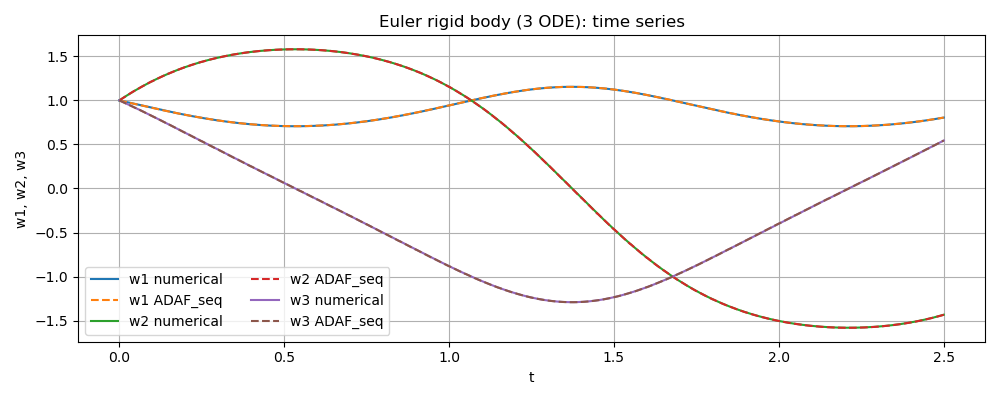

Euler rigid body (ADAF_seq)
===========================

Problem setup
-------------

We solve the Euler equations for a torque-free rigid body described by three coupled first-order ODEs on a time interval :math:`t \in [0, 2.5]`.
The three state variables are the angular velocity components

- :math:`w_1(t)`
- :math:`w_2(t)`
- :math:`w_3(t)`

With principal moments of inertia :math:`I_1, I_2, I_3`, the governing equations are

.. math::

   \frac{d w_1}{dt} = \frac{I_2 - I_3}{I_2 I_3} w_2 w_3, \qquad
   \frac{d w_2}{dt} = \frac{I_3 - I_1}{I_1 I_3} w_1 w_3, \qquad
   \frac{d w_3}{dt} = \frac{I_1 - I_2}{I_1 I_2} w_1 w_2.

The initial condition is given by

.. math::

   w_1(0)=1,\qquad w_2(0)=1,\qquad w_3(0)=1.

In this example, we use

.. math::

   I_1 = 0.2,\qquad I_2 = 0.3,\qquad I_3 = 0.4.

Implementation
--------------

This section walks through the implementation step-by-step. The complete runnable source code is stored at the end.

1) Import libraries
~~~~~~~~~~~~~~~~~~~

We first import the ADAF_seq library and common numerical/plotting utilities.
SciPy ``solve_ivp`` is used only to compute a reference solution for validation.

.. literalinclude:: ../../examples/tests_ADAF_seq_euler.py
   :language: python
   :linenos:
   :lines: 1-7

2) Define constants, time interval, and initial conditions
~~~~~~~~~~~~~~~~~~~~~~~~~~~~~~~~~~~~~~~~~~~~~~~~~~~~~~~~~~

We define the inertia parameters (:math:`I_1, I_2, I_3`), the time interval bounds (:math:`lb, ub`),
and initial conditions ``ic = [w1(0), w2(0), w3(0)]``.

.. literalinclude:: ../../examples/tests_ADAF_seq_euler.py
   :language: python
   :linenos:
   :lines: 10-18

3) Define the ODE residual function (callable)
~~~~~~~~~~~~~~~~~~~~~~~~~~~~~~~~~~~~~~~~~~~~~~

The ADAF_seq solver expects a callable function ``ode_res(var_list, i)``, which returns the residual of the system of ODE.
Here, ``var_list[k]`` provides a pair ``(y_k, y_k_t)`` corresponding to the state and its time derivative.
The function should return the residual for equation index ``i``:

- ``i=0``: equation for :math:`w_1`
- ``i=1``: equation for :math:`w_2`
- ``i=2``: equation for :math:`w_3`

.. literalinclude:: ../../examples/tests_ADAF_seq_euler.py
   :language: python
   :linenos:
   :lines: 21-38

4) Configure solver options (grid / Adam / L-BFGS)
~~~~~~~~~~~~~~~~~~~~~~~~~~~~~~~~~~~~~~~~~~~~~~~~~~

We construct three option objects before calling the solver:

- ``GridOptions``: global sampling + segmentation setup
- ``AdamOptions``: Adam training hyperparameters
- ``LBFGSOptions``: optional L-BFGS refinement stage

.. literalinclude:: ../../examples/tests_ADAF_seq_euler.py
   :language: python
   :linenos:
   :lines: 41-44

5) Run ADAF_seq solver and extract the solution
~~~~~~~~~~~~~~~~~~~~~~~~~~~~~~~~~~~~~~~~~~~~~~~

The solver is executed through ``ADAF_seq.solve_ivp``.
The returned ``solver.solution`` provides:

- ``t``: time array of shape ``(Nt_total,)``
- ``y``: state array of shape ``(3, Nt_total)`` where rows correspond to :math:`w_1, w_2, w_3`

.. literalinclude:: ../../examples/tests_ADAF_seq_euler.py
   :language: python
   :linenos:
   :lines: 46-62

6) Compute a numerical reference solution (Optional)
~~~~~~~~~~~~~~~~~~~~~~~~~~~~~~~~~~~~~~~~~~~~~~~~~~

For validation, we solve the same ODE system using SciPy ``solve_ivp`` evaluated on the same grid ``t``.
We set tight tolerances to obtain a high-accuracy reference.

.. literalinclude:: ../../examples/tests_ADAF_seq_euler.py
   :language: python
   :linenos:
   :lines: 64-73

7) Plot time-series comparison (Optional)
~~~~~~~~~~~~~~~~~~~~~~~~~~~~~~~~~~~~~~~~~

We compare ADAF_seq predictions against the numerical reference in a single time-series plot.

.. literalinclude:: ../../examples/tests_ADAF_seq_euler.py
   :language: python
   :linenos:
   :lines: 75-88

The resulting plot of the numerical solution and the model prediction follows:

Complete source code
--------------------

.. literalinclude:: ../../examples/tests_ADAF_seq_euler.py
   :language: python
   :linenos:
