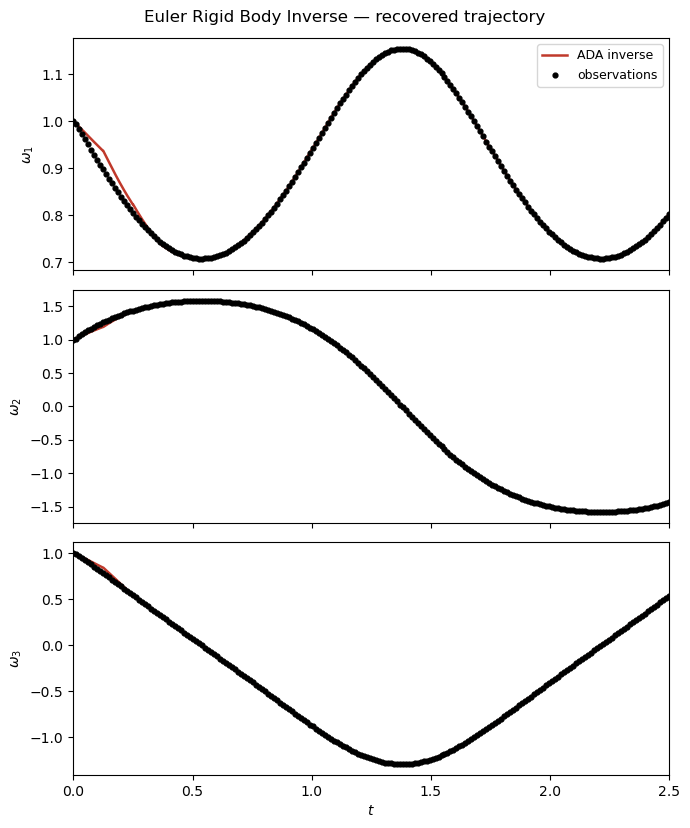
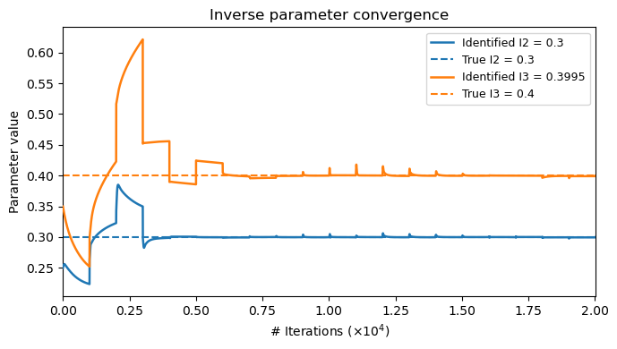
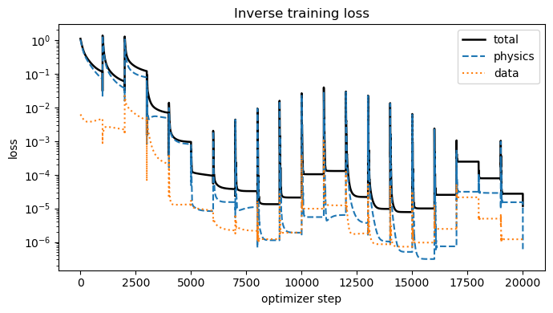

Euler Rigid-Body Inverse Problem
================================

Problem Setup
-------------

This example demonstrates inverse parameter identification for the
Euler rigid-body system using ADALib.

The governing equations are

.. math::

   \frac{d\omega_1}{dt}
   =
   \frac{I_2-I_3}{I_2 I_3}
   \omega_2\omega_3,

.. math::

   \frac{d\omega_2}{dt}
   =
   \frac{I_3-I_1}{I_1 I_3}
   \omega_1\omega_3,

.. math::

   \frac{d\omega_3}{dt}
   =
   \frac{I_1-I_2}{I_1 I_2}
   \omega_1\omega_2,

where :math:`\omega_1`, :math:`\omega_2`, and :math:`\omega_3`
are the angular velocities and :math:`I_1`, :math:`I_2`, and
:math:`I_3` are the principal moments of inertia.

The true parameter values used to generate the observation data are

.. math::

   I_1=0.2,\qquad
   I_2=0.3,\qquad
   I_3=0.4.

The initial condition is

.. math::

   [\omega_1(0),\omega_2(0),\omega_3(0)]
   =
   [1,1,1],

and the system is evaluated over

.. math::

   t\in[0,2.5].

Parameter Identifiability
-------------------------

For the Euler rigid-body equations, only the ratios between the moments
of inertia affect the system dynamics.

Therefore, all three inertia parameters cannot be uniquely identified
simultaneously from the trajectory.

In this example,

.. math::

   I_1=0.2

is fixed, while

.. math::

   I_2,\qquad I_3

are treated as unknown parameters to be estimated.

Inverse-Learning Workflow
-------------------------

The ADALib inverse workflow consists of the following steps:

1. Define the dynamical system and its true parameters.
2. Solve the corresponding forward problem.
3. Generate observation data from the forward solution.
4. Define the unknown parameters using ``InverseParameter``.
5. Configure ``InverseOptions``.
6. Execute ``adalib.run_inverse``.
7. Inspect the estimated parameters and reconstructed trajectory.
8. Visualize the parameter convergence, recovered states, and loss history.

The complete workflow can be summarized as

.. code-block:: text

   ODE System + True Parameters
              ↓
         run_forward
              ↓
       ForwardResult
              ↓
          data_gen
              ↓
      Observation Data
              ↓
   InverseParameter + InverseOptions
              ↓
         run_inverse
              ↓
        InverseResult
              ↓
   Estimated Parameters / Trajectory

1. Import Libraries
~~~~~~~~~~~~~~~~~~~

First, import Matplotlib and ADALib.

.. code-block:: python

   import matplotlib
   matplotlib.use("Agg")
   import adalib

The ``Agg`` backend allows the example to save figures without requiring
an interactive plotting window.

2. Define the Euler System
~~~~~~~~~~~~~~~~~~~~~~~~~~

The true moments of inertia are defined as

.. code-block:: python

   TRUE_I1 = 0.2
   TRUE_I2 = 0.3
   TRUE_I3 = 0.4

The built-in Euler system is then constructed using

.. code-block:: python

   system = adalib.get_system(
       "euler",
       I1=TRUE_I1,
       I2=TRUE_I2,
       I3=TRUE_I3,
   )

The initial condition and simulation interval are

.. code-block:: python

   X0 = [1.0, 1.0, 1.0]
   T_SPAN = (0.0, 2.5)

3. Configure the Forward Solver
~~~~~~~~~~~~~~~~~~~~~~~~~~~~~~~

A forward solution is first generated to construct synthetic observation
data for the inverse problem.

.. code-block:: python

   fwd_options = adalib.ForwardOptions(
       basis="adaf",
       n_seg=20,
       N_p=10,
       N_m=100,
       Nt_total=2000,
       epochs=5,
       adam_inner=100,
       use_lbfgs=True,
       dtype="float64",
       verbose=False,
   )

The forward solver uses the ADAF basis with temporal segmentation and
Adam optimization followed by optional L-BFGS refinement.

4. Generate the Ground-Truth Trajectory
~~~~~~~~~~~~~~~~~~~~~~~~~~~~~~~~~~~~~~~

The forward problem is solved using the true parameter values.

.. code-block:: python

   fwd_result = adalib.run_forward(
       system=system,
       x0=X0,
       t_span=T_SPAN,
       params=[TRUE_I1, TRUE_I2, TRUE_I3],
       options=fwd_options,
   )

The returned object contains the time coordinates and state trajectories:

.. code-block:: python

   print(f"t shape : {fwd_result.t.shape}")
   print(f"y shape : {fwd_result.y.shape}")

5. Generate Observation Data
~~~~~~~~~~~~~~~~~~~~~~~~~~~~

Observation data are generated directly from the forward solution using
``adalib.data_gen``.

.. code-block:: python

   obs = adalib.data_gen(
       fwd_result,
       n_points=200,
       noise_std=0,
       seed=123,
       state_indices=[0, 1, 2],
   )

The present example uses

- 200 observation points,
- zero observation noise,
- all three angular-velocity states.

The generated observations are subsequently used as the data constraint
during inverse training.

6. Configure InverseOptions
~~~~~~~~~~~~~~~~~~~~~~~~~~~

The inverse optimization settings are defined independently using
``adalib.InverseOptions``.

.. code-block:: python

   inv_options = adalib.InverseOptions(
       n_seg=10,
       N_p=5,
       N_m=100,
       Nt_total=2000,
       lambda_physics=1.0,
       lambda_data=10.0,
       epochs=5,
       adam_inner=200,
       adam_lr=1e-3,
       use_lbfgs=True,
       n_passes=1,
       dtype="float64",
       verbose=True,
       param_log_every=1,
   )

The principal inverse settings are:

- ``lambda_physics``: weight applied to the governing-equation residual loss.
- ``lambda_data``: weight applied to the observation-data loss.
- ``epochs``: number of outer Adam training epochs.
- ``adam_inner``: number of Adam iterations per epoch.
- ``adam_lr``: Adam learning rate.
- ``use_lbfgs``: enables the L-BFGS refinement stage.
- ``param_log_every``: controls how frequently estimated parameters are reported.

7. Define Unknown Parameters
~~~~~~~~~~~~~~~~~~~~~~~~~~~~

The known inertia :math:`I_1` is supplied as a fixed scalar, while
:math:`I_2` and :math:`I_3` are represented using
``adalib.InverseParameter``.

.. code-block:: python

   params = {
       "I1": TRUE_I1,

       "I2": adalib.InverseParameter(
           initial=0.25,
           lower=0.05,
           upper=2.0,
       ),

       "I3": adalib.InverseParameter(
           initial=0.35,
           lower=0.05,
           upper=2.0,
       ),
   }

The initial guesses are therefore

.. math::

   I_2^{(0)}=0.25,
   \qquad
   I_3^{(0)}=0.35,

while both trainable parameters are constrained to the interval

.. math::

   0.05 \le I_2,I_3 \le 2.0.

8. Run Inverse Training
~~~~~~~~~~~~~~~~~~~~~~~

The parameter-identification problem is executed through
``adalib.run_inverse``.

.. code-block:: python

   inv_result = adalib.run_inverse(
       system=system,
       x0=X0,
       t_span=T_SPAN,
       params=params,
       data=obs,
       options=inv_options,
   )

During training, ADALib jointly minimizes the physics-informed residual
and the mismatch between the reconstructed trajectory and the observation
data.

9. Access Estimated Parameters
~~~~~~~~~~~~~~~~~~~~~~~~~~~~~~

The identified physical parameters are stored in

.. code-block:: python

   est = inv_result.estimated_params

The recovered values can be inspected using

.. code-block:: python

   print(
       f"I2 : true={TRUE_I2:.4f} "
       f"estimated={est['I2']:.4f}"
   )

   print(
       f"I3 : true={TRUE_I3:.4f} "
       f"estimated={est['I3']:.4f}"
   )

The absolute percentage errors are evaluated as

.. math::

   E_{I_i}
   =
   \frac{
   \left|
   I_i^{\mathrm{est}}
   -
   I_i^{\mathrm{true}}
   \right|
   }{
   I_i^{\mathrm{true}}
   }
   \times100\%.

The final loss and runtime are also available through

.. code-block:: python

   inv_result.loss_history
   inv_result.runtime_sec

10. Access the Reconstructed Trajectory
~~~~~~~~~~~~~~~~~~~~~~~~~~~~~~~~~~~~~~~

The inverse result also contains the state trajectory reconstructed using
the estimated physical parameters.

.. code-block:: python

   print(f"t shape : {inv_result.t.shape}")
   print(f"y shape : {inv_result.y.shape}")

The state ordering is

.. code-block:: text

   inv_result.y[0] → omega1
   inv_result.y[1] → omega2
   inv_result.y[2] → omega3

11. Plot the Recovered Trajectory
~~~~~~~~~~~~~~~~~~~~~~~~~~~~~~~~~

The reconstructed trajectory can be compared directly with the observation
data.

.. code-block:: python

   fig_t, _ = inv_result.plot(
       state_names=[
           "$\\omega_1$",
           "$\\omega_2$",
           "$\\omega_3$",
       ],
       save_path="euler_inverse_result",
       observation_data=obs,
       title=(
           "Euler Rigid Body Inverse — "
           "recovered trajectory"
       ),
       true_params={
           "I2": TRUE_I2,
           "I3": TRUE_I3,
       },
   )

The resulting trajectory figure is saved as

.. code-block:: text

   euler_inverse_result_trajectory.png

12. Plot Parameter Convergence
~~~~~~~~~~~~~~~~~~~~~~~~~~~~~~

The estimated inertia parameters can be visualized using
``plot_params``.

.. code-block:: python

   fig_p = inv_result.plot_params(
       true_params={
           "I2": TRUE_I2,
           "I3": TRUE_I3,
       },
       save_path="euler_inverse_result_params.png",
       figsize=(5, 4),
   )

13. Plot the Loss History
~~~~~~~~~~~~~~~~~~~~~~~~~

The inverse-training loss history can be visualized using

.. code-block:: python

   fig_loss = inv_result.plot_loss(
       save_path="euler_inverse_loss.png"
   )

Complete Source Code
--------------------

The complete runnable example is available below.

.. literalinclude:: ../../tests/test_adalib_inverse_euler.py
   :language: python
   :linenos:
