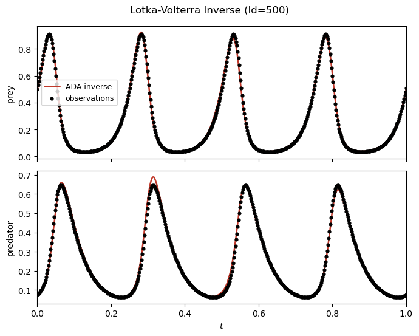
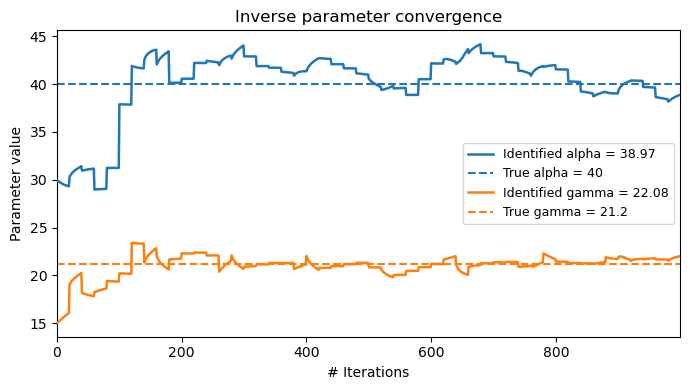

Lotka–Volterra Inverse Problem 
==============================

Problem Setup
-------------

This example demonstrates inverse parameter identification for the
Lotka–Volterra predator–prey system using ADALib.

The governing equations are

.. math::

   \frac{dx}{dt}
   =
   \alpha x-\beta xy,

.. math::

   \frac{dy}{dt}
   =
   -\gamma y+\delta xy,

where :math:`x(t)` and :math:`y(t)` denote the normalized prey and predator
states, respectively.

The parameter values are defined using

.. math::

   U_{\mathrm{scale}}=200,
   \qquad
   R_{\mathrm{scale}}=20,

giving

.. math::

   \alpha=40,

.. math::

   \beta=160,

.. math::

   \gamma=21.2,

.. math::

   \delta=80.

In this inverse problem, :math:`\alpha` and :math:`\gamma` are treated as
unknown parameters, while :math:`\beta` and :math:`\delta` remain fixed.

Therefore,

.. math::

   \alpha,\gamma
   \quad\text{are estimated},

while

.. math::

   \beta=160,
   \qquad
   \delta=80

are known.

The initial condition is

.. math::

   x(0)=\frac{100}{200}=0.5,

.. math::

   y(0)=\frac{15}{200}=0.075,

and the system is evaluated over

.. math::

   t\in[0,1].

Choice of Inverse Parameters
----------------------------

The present example estimates :math:`\alpha` and :math:`\gamma` directly.

These parameters correspond to the prey-growth and predator-decay terms
of the normalized Lotka–Volterra equations.

The implementation uses

.. math::

   \alpha^{(0)}=30,

.. math::

   \gamma^{(0)}=15

as the initial guesses, while the true values are

.. math::

   \alpha=40,
   \qquad
   \gamma=21.2.

Inverse-Learning Workflow
-------------------------

The workflow consists of the following steps:

1. Define the Lotka–Volterra system and true parameters.
2. Generate a forward solution.
3. Sample observation data from the forward trajectory.
4. Configure the ADA inverse solver.
5. Define trainable and fixed physical parameters.
6. Execute ``adalib.run_inverse``.
7. Evaluate the recovered parameters and trajectory.
8. Visualize the inverse solution and training history.

The overall workflow is

.. code-block:: text

   Lotka-Volterra System
            ↓
      True Parameters
            ↓
       run_forward
            ↓
      ForwardResult
            ↓
        data_gen
            ↓
    Observation Data
            ↓
   InverseParameter
            +
     InverseOptions
            ↓
       run_inverse
            ↓
      InverseResult

1. Import Libraries
~~~~~~~~~~~~~~~~~~~

First, import the required libraries.

.. code-block:: python

   import matplotlib
   matplotlib.use("Agg")
   import os
   import adalib

The ``os`` module is used to define a fixed output directory for the
generated inverse-training results.

2. Define the Output Directory
~~~~~~~~~~~~~~~~~~~~~~~~~~~~~~

The example stores inverse output files next to the test script.

.. code-block:: python

   _HERE = os.path.dirname(
       os.path.abspath(__file__)
   )

   OUTPUT_DIR = os.path.join(
       _HERE,
       "lv_inverse_outputs",
   )

3. Define the Lotka–Volterra Parameters
~~~~~~~~~~~~~~~~~~~~~~~~~~~~~~~~~~~~~~~

The normalized scaling constants are

.. code-block:: python

   U_SCALE = 200.0
   R_SCALE = 20.0

The true physical parameters are

.. code-block:: python

   TRUE_ALPHA = 2.0 * R_SCALE
   TRUE_BETA  = 0.04 * R_SCALE * U_SCALE
   TRUE_GAMMA = 1.06 * R_SCALE
   TRUE_DELTA = 0.02 * R_SCALE * U_SCALE

which correspond to

.. code-block:: text

   alpha = 40.0
   beta  = 160.0
   gamma = 21.2
   delta = 80.0

4. Construct the ODE System
~~~~~~~~~~~~~~~~~~~~~~~~~~~

The built-in Lotka–Volterra system is constructed using the true
parameters.

.. code-block:: python

   system = adalib.get_system(
       "lotka_volterra",
       alpha=TRUE_ALPHA,
       beta=TRUE_BETA,
       gamma=TRUE_GAMMA,
       delta=TRUE_DELTA,
   )

The initial condition and time interval are

.. code-block:: python

   X0 = [
       100.0 / U_SCALE,
       15.0 / U_SCALE,
   ]

   T_SPAN = (0.0, 1.0)

corresponding to

.. math::

   \mathbf{x}_0
   =
   [0.5,\ 0.075].

5. Configure the Forward Solver
~~~~~~~~~~~~~~~~~~~~~~~~~~~~~~~

A forward solution is first generated using the true parameter set.

.. code-block:: python

   fwd_options = adalib.ForwardOptions(
       basis="adaf",
       n_seg=50,
       N_p=5,
       N_m=100,
       Nt_total=2500,
       epochs=5,
       adam_inner=100,
       use_lbfgs=True,
       dtype="float64",
       verbose=False,
   )

6. Generate the Ground-Truth Trajectory
~~~~~~~~~~~~~~~~~~~~~~~~~~~~~~~~~~~~~~~

The forward problem is solved using

.. code-block:: python

   fwd_result = adalib.run_forward(
       system=system,
       x0=X0,
       t_span=T_SPAN,
       params=[
           TRUE_ALPHA,
           TRUE_BETA,
           TRUE_GAMMA,
           TRUE_DELTA,
       ],
       options=fwd_options,
   )

The resulting state trajectory is used only to generate synthetic
observations for the inverse problem.

7. Generate Observation Data
~~~~~~~~~~~~~~~~~~~~~~~~~~~~

Observation samples are generated from both Lotka–Volterra states.

.. code-block:: python

   obs = adalib.data_gen(
       fwd_result,
       n_points=500,
       noise_std=0.0,
       seed=42,
       state_indices=[0, 1],
   )

The present example uses

- 500 observation points,
- no added observation noise,
- both prey and predator states.

8. Configure InverseOptions
~~~~~~~~~~~~~~~~~~~~~~~~~~~

The inverse solver is configured through

.. code-block:: python

   inv_options = adalib.InverseOptions(
       n_seg=30,
       N_p=20,
       N_m=100,
       Nt_total=2000,
       lambda_physics=1e0,
       lambda_data=1e0,
       epochs=50,
       adam_inner=100,
       adam_lr=1e-3,
       use_lbfgs=True,
       n_passes=1,
       dtype="float64",
       verbose=True,
       param_log_every=10,
       output_dir=OUTPUT_DIR,
       true_params={
           "alpha": TRUE_ALPHA,
           "gamma": TRUE_GAMMA,
       },
   )

The inverse loss combines physics and observation information.

The loss weights are set to

.. math::

   \lambda_{\mathrm{physics}}=1,

.. math::

   \lambda_{\mathrm{data}}=1.

9. Define Trainable Physical Parameters
~~~~~~~~~~~~~~~~~~~~~~~~~~~~~~~~~~~~~~~

The prey-growth parameter :math:`\alpha` and predator-decay parameter
:math:`\gamma` are made trainable using ``InverseParameter``.

.. code-block:: python

   params = {
       "alpha": adalib.InverseParameter(
           initial=30.0,
           lower=0.1,
       ),

       "beta": TRUE_BETA,

       "gamma": adalib.InverseParameter(
           initial=15.0,
           lower=0.1,
       ),

       "delta": TRUE_DELTA,
   }

Therefore,

.. code-block:: text

   Trainable:
       alpha
       gamma

   Fixed:
       beta
       delta

The lower bound

.. math::

   0.1

is imposed on both trainable parameters.

10. Run Inverse Training
~~~~~~~~~~~~~~~~~~~~~~~~

The parameter-identification problem is executed through
``adalib.run_inverse``.

.. code-block:: python

   inv_result = adalib.run_inverse(
       system=system,
       x0=X0,
       t_span=T_SPAN,
       params=params,
       data=obs,
       options=inv_options,
   )

The ADA state representation and the unknown physical parameters are
optimized using the governing-equation residuals together with the
observation-data loss.

11. Access Estimated Parameters
~~~~~~~~~~~~~~~~~~~~~~~~~~~~~~~

The estimated values are available through

.. code-block:: python

   est = inv_result.estimated_params

For example,

.. code-block:: python

   print(
       f"alpha : true={TRUE_ALPHA:.4f} "
       f"estimated={est['alpha']:.4f}"
   )

   print(
       f"gamma : true={TRUE_GAMMA:.4f} "
       f"estimated={est['gamma']:.4f}"
   )

The relative parameter error is evaluated as

.. math::

   E_{\theta}
   =
   \frac{
   \left|
   \theta_{\mathrm{est}}
   -
   \theta_{\mathrm{true}}
   \right|
   }{
   \theta_{\mathrm{true}}
   }
   \times100\%.

The final training loss and runtime are stored in

.. code-block:: python

   inv_result.loss_history[-1]
   inv_result.runtime_sec

12. Plot the Recovered Trajectory
~~~~~~~~~~~~~~~~~~~~~~~~~~~~~~~~~

The reconstructed trajectory can be visualized together with the
observation data.

.. code-block:: python

   fig_t, _ = inv_result.plot(
       state_names=[
           "prey",
           "predator",
       ],
       save_path="lv_inverse_result",
       observation_data=obs,
       title=(
           "Lotka-Volterra Inverse — "
           "recovered trajectory"
       ),
       true_params={
           "alpha": TRUE_ALPHA,
           "gamma": TRUE_GAMMA,
       },
   )

The generated trajectory figure is

.. code-block:: text

   lv_inverse_result_trajectory.png

13. Plot Parameter Convergence
~~~~~~~~~~~~~~~~~~~~~~~~~~~~~~

The estimated values of :math:`\alpha` and :math:`\gamma` can be compared
with their true values using ``plot_params``.

.. code-block:: python

   fig_p = inv_result.plot_params(
       true_params={
           "alpha": TRUE_ALPHA,
           "gamma": TRUE_GAMMA,
       },
       save_path=os.path.join(
           OUTPUT_DIR,
           "lv_inverse_result_params.png",
       ),
       figsize=(5, 4),
   )

14. Plot the Loss History
~~~~~~~~~~~~~~~~~~~~~~~~~

The optimization history can be visualized using

.. code-block:: python

   fig_loss = inv_result.plot_loss(
       save_path="lv_inverse_loss.png"
   )

.. figure:: lv_inverse_loss.png
   :width: 70%
   :align: center
   :alt: Lotka-Volterra inverse loss history

Complete Source Code
--------------------

The complete runnable example is available below.

.. literalinclude:: ../../tests/test_adalib_inverse_lv.py
   :language: python
   :linenos:
