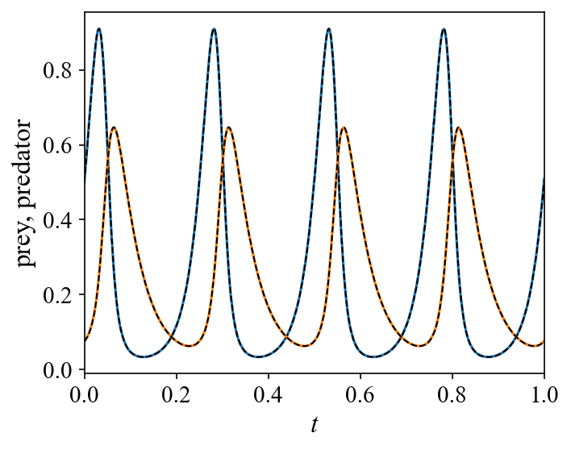

Lotka–Volterra System
=====================

Problem Setup
-------------

This example demonstrates how to solve a user-defined Lotka–Volterra
predator–prey system using the ADALib forward solver.

The governing equations are

.. math::

   \frac{dr}{dt}
   =
   \alpha r-\beta rp,

.. math::

   \frac{dp}{dt}
   =
   \delta rp-\gamma p,

where :math:`r(t)` and :math:`p(t)` denote the normalized prey and
predator populations, respectively.

The parameters are defined using the scaling constants

.. math::

   U_{\mathrm{scale}}=200,
   \qquad
   R_{\mathrm{scale}}=20,

giving

.. math::

   \alpha=40,\qquad
   \beta=160,\qquad
   \gamma=21.2,\qquad
   \delta=80.

The initial conditions are

.. math::

   r(0)=\frac{100}{U_{\mathrm{scale}}}=0.5,

.. math::

   p(0)=\frac{15}{U_{\mathrm{scale}}}=0.075,

and the system is solved over

.. math::

   t\in[0,1].

Implementation
--------------

The forward-solving workflow consists of four main steps:

1. Define the governing ODE equations.
2. Construct a ``CallableODESystem``.
3. Configure ``ForwardOptions``.
4. Solve the system using ``adalib.run_forward``.

The returned result object provides the predicted time coordinates and
state trajectories.

1. Import Libraries
~~~~~~~~~~~~~~~~~~~

First, import ADALib and the numerical libraries used in this example.

.. code-block:: python

   import numpy as np
   import matplotlib
   matplotlib.use("Agg")
   import matplotlib.pyplot as plt
   from scipy.integrate import solve_ivp
   import adalib

SciPy ``solve_ivp`` is used only to generate a numerical reference
solution for validation and is not required by the ADALib solver.

2. Define the System Parameters
~~~~~~~~~~~~~~~~~~~~~~~~~~~~~~~

The Lotka–Volterra coefficients are defined from the normalized scaling
parameters.

.. code-block:: python

   U_SCALE = 200.0
   R_SCALE = 20.0

   ALPHA = 2.0  * R_SCALE
   BETA  = 0.04 * R_SCALE * U_SCALE
   GAMMA = 1.06 * R_SCALE
   DELTA = 0.02 * R_SCALE * U_SCALE

This gives

.. code-block:: text

   ALPHA = 40.0
   BETA  = 160.0
   GAMMA = 21.2
   DELTA = 80.0

3. Define the Numerical RHS
~~~~~~~~~~~~~~~~~~~~~~~~~~~

The first callable defines the conventional right-hand side of the ODE
system.

.. code-block:: python

   def lotka_rhs(t, state, u=None, p=None):
       prey, predator = state

       dprey_dt = ALPHA * prey - BETA * prey * predator
       dpredator_dt = DELTA * prey * predator - GAMMA * predator

       return [
           dprey_dt,
           dpredator_dt,
       ]

The arguments ``u`` and ``p`` are optional interfaces for external inputs
and system parameters. They are not required for the present problem.

4. Define the Physics Residual
~~~~~~~~~~~~~~~~~~~~~~~~~~~~~~

ADALib additionally requires a TensorFlow-compatible residual definition
for physics-informed optimization.

.. code-block:: python

   def lotka_rhs_tf(var_list, i, u=None, p=None):
       prey, prey_t = var_list[0]
       predator, predator_t = var_list[1]

       if i == 0:
           return prey_t - (
               ALPHA * prey
               - BETA * prey * predator
           )

       else:
           return predator_t - (
               DELTA * prey * predator
               - GAMMA * predator
           )

For each state, ``var_list`` provides the state value and its corresponding
time derivative.

For example,

.. code-block:: python

   prey, prey_t = var_list[0]
   predator, predator_t = var_list[1]

The two residual equations are therefore

.. math::

   \mathcal{R}_r
   =
   \dot{r}
   -
   \left(\alpha r-\beta rp\right),

.. math::

   \mathcal{R}_p
   =
   \dot{p}
   -
   \left(\delta rp-\gamma p\right).

During training, ADALib minimizes these governing-equation residuals.

5. Construct CallableODESystem
~~~~~~~~~~~~~~~~~~~~~~~~~~~~~~

The numerical RHS and physics residual are combined into a common ADALib
system object.

.. code-block:: python

   system = adalib.CallableODESystem(
       name="lotka_volterra",
       rhs=lotka_rhs,
       rhs_tf=lotka_rhs_tf,
       state_names=["prey", "predator"],
   )

The ``CallableODESystem`` separates the mathematical definition of the
dynamical system from the numerical configuration of the solver.

The same system object can therefore be reused with different initial
conditions, time domains, or solver settings.

6. Configure ForwardOptions
~~~~~~~~~~~~~~~~~~~~~~~~~~~

The numerical and training settings are specified through
``adalib.ForwardOptions``.

.. code-block:: python

   options = adalib.ForwardOptions(
       basis="adaf",
       n_seg=50,
       N_p=5,
       N_m=100,
       Nt_total=2500,
       epochs=5,
       adam_inner=100,
       use_lbfgs=True,
       dtype="float64",
       verbose=True,
   )

The principal options are:

- ``basis``: basis representation used by the ADA solver.
- ``n_seg``: number of temporal segments.
- ``N_p``: number of ADA panels.
- ``N_m``: number of training points.
- ``Nt_total``: number of output time coordinates.
- ``epochs``: number of outer Adam training epochs.
- ``adam_inner``: number of Adam iterations per epoch.
- ``use_lbfgs``: enables the L-BFGS refinement stage.
- ``dtype``: floating-point precision used during training.

7. Run the Forward Solver
~~~~~~~~~~~~~~~~~~~~~~~~~

The initial condition and time domain are defined independently from the
ODE system.

.. code-block:: python

   X0 = [100.0 / U_SCALE, 15.0 / U_SCALE]
   T_SPAN = (0.0, 1.0)

The forward problem is then solved through the high-level interface
``adalib.run_forward``.

.. code-block:: python

   result = adalib.run_forward(
       system=system,
       x0=X0,
       t_span=T_SPAN,
       options=options,
   )

Thus, the complete user workflow is

.. code-block:: text

   Governing equations
          ↓
   CallableODESystem
          ↓
   ForwardOptions
          ↓
   run_forward
          ↓
   ForwardResult

8. Access the Solution
~~~~~~~~~~~~~~~~~~~~~~

The returned result object contains the reconstructed state trajectory.

.. code-block:: python

   t = result.t
   y = result.y

where

- ``result.t`` contains the time coordinates.
- ``result.y[0]`` contains the prey trajectory.
- ``result.y[1]`` contains the predator trajectory.

For the current configuration,

.. code-block:: python

   print(f"t shape : {result.t.shape}")
   print(f"y shape : {result.y.shape}")

9. Numerical Reference Solution
~~~~~~~~~~~~~~~~~~~~~~~~~~~~~~~

For validation only, the same user-defined numerical RHS can be integrated
using SciPy RK45.

.. code-block:: python

   sol_ref = solve_ivp(
       lambda t, x: system.rhs(t, x),
       T_SPAN,
       X0,
       method="RK45",
       t_eval=t,
       rtol=1e-10,
       atol=1e-12,
   )

   ref = sol_ref.y

This reference solution is not required when solving the forward problem
with ADALib.

10. Relative Error
~~~~~~~~~~~~~~~~~~

The relative :math:`L_2` error can be evaluated for each state using

.. math::

   \varepsilon_i
   =
   \frac{
   \left\|y_i^{\mathrm{ADA}}-y_i^{\mathrm{ref}}\right\|_2
   }{
   \left\|y_i^{\mathrm{ref}}\right\|_2
   }.

.. code-block:: python

   state_names = ["prey", "predator"]

   for i, name in enumerate(state_names):
       err = (
           np.linalg.norm(y[i] - ref[i])
           / (np.linalg.norm(ref[i]) + 1e-12)
       )
       print(f"{name}: {err:.4e}")

11. Visualization
~~~~~~~~~~~~~~~~~

The ADALib predictions can be compared with the numerical reference
solution.

.. code-block:: python

   fig, ax = plt.subplots(figsize=(5, 4))

   colors = ["C0", "C1"]

   for j in range(2):
       ax.plot(t, y[j], color=colors[j], lw=1.5)
       ax.plot(t, ref[j], "k--", lw=1.0)

   ax.set_ylabel("prey, predator")
   ax.set_xlabel("$t$")
   ax.set_xlim(t[0], t[-1])

   fig.tight_layout()
   fig.savefig(
       "lotka_forward_result.png",
       dpi=150,
       bbox_inches="tight",
   )

The resulting trajectory comparison is shown below.

Complete Source Code
--------------------

The complete runnable example is available below.

.. literalinclude:: ../../tests/test_adalib_forward_lotka.py
   :language: python
   :linenos:
