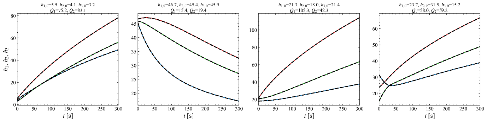

Triple-Tank Operator Learning
=============================

Using Other Built-in Benchmark Systems
--------------------------------------

ADALib provides several built-in dynamical systems that can be directly
used with the operator-learning workflow.

The Triple-Tank system used in this tutorial is constructed as

.. code-block:: python

   system = adalib.get_system("triple_tank")

The benchmark systems used in the ADALib study can be selected through
the same interface simply by changing the registered system name:

.. code-block:: python

   # Triple-Tank
   system = adalib.get_system("triple_tank")

   # Lotka-Volterra
   system = adalib.get_system("lotka_volterra")

   # CSTR
   system = adalib.get_system("cstr")

   # Fed-Batch Bioreactor
   system = adalib.get_system("fedbatch_bioreactor")

Therefore, the system-object construction follows the same interface
across the Lotka-Volterra, CSTR, Fed-Batch Bioreactor, and Triple-Tank
benchmarks.

The corresponding initial conditions, system inputs, and
feature-specific options should still be configured according to the
target system.

Problem Setup
-------------

This example demonstrates operator learning for the nonlinear
Three-Tank benchmark using ADALib.

The system consists of three interconnected tanks whose liquid levels
are governed by gravity-driven flows through connecting orifices.

The state vector is

.. math::

   \mathbf{x}
   =
   \begin{bmatrix}
   h_1 & h_2 & h_3
   \end{bmatrix}^{T},

where

- :math:`h_1`: liquid level of Tank 1,
- :math:`h_2`: liquid level of Tank 2,
- :math:`h_3`: liquid level of Tank 3.

The two external pump inputs are

.. math::

   \mathbf{q}
   =
   \begin{bmatrix}
   q_1 & q_2
   \end{bmatrix}^{T}.

The gravity-driven inter-tank flows are defined using Torricelli's law:

.. math::

   q_{13}
   =
   a_{13}
   \operatorname{sgn}(h_1-h_3)
   \sqrt{2g|h_1-h_3|},

.. math::

   q_{32}
   =
   a_{32}
   \operatorname{sgn}(h_3-h_2)
   \sqrt{2g|h_3-h_2|},

.. math::

   q_{20}
   =
   a_{20}
   \sqrt{2g|h_2|}.

The governing equations implemented in ADALib are

.. math::

   \frac{dh_1}{dt}
   =
   \frac{q_1/3600-q_{13}}{A},

.. math::

   \frac{dh_2}{dt}
   =
   \frac{q_2/3600+q_{32}-q_{20}}{A},

.. math::

   \frac{dh_3}{dt}
   =
   \frac{q_{13}-q_{32}}{A}.

The built-in Triple-Tank model uses

.. math::

   A=0.3048,

.. math::

   a_{13}=a_{32}=1.127\times10^{-4},

.. math::

   a_{20}=1.527\times10^{-4},

and

.. math::

   g=981.

Operator-Learning Workflow
--------------------------

Unlike the forward solver, which optimizes an ADA representation for one
specific initial-value problem, the operator-learning workflow trains a
neural network that can generate the ADA representation for different
system configurations.

The workflow consists of the following main steps:

1. Select the ODE system.
2. Configure ``OperatorOptions``.
3. Generate the operator-training dataset.
4. Train the operator network.
5. Perform inference for a target initial condition and system input.
6. Reuse the trained checkpoint for new configurations.
7. Compare the predicted trajectories with a numerical reference.

The overall workflow is

.. code-block:: text

   Built-in ODE System
          ↓
   OperatorOptions
          ↓
   Training Data Generation
          ↓
   Operator Training
          ↓
   Trained Checkpoint
          ↓
   New Initial Condition / Input
          ↓
   run_operator
          ↓
   OperatorResult

1. Import Libraries
~~~~~~~~~~~~~~~~~~~

First, import NumPy, Matplotlib, and ADALib.

.. code-block:: python

   import numpy as np
   import matplotlib
   matplotlib.use("Agg")
   import adalib

   adalib.utils.set_adalib_plot_style(style="serif")

The Matplotlib ``Agg`` backend is used because the example saves the
generated figures directly to files.

2. Load the Triple-Tank System
~~~~~~~~~~~~~~~~~~~~~~~~~~~~~~

The Three-Tank benchmark is already registered as a built-in ADALib
system.

It can therefore be constructed with a single line:

.. code-block:: python

   system = adalib.get_system("triple_tank")

The resulting system object contains the three state variables

.. code-block:: text

   h1
   h2
   h3

and the two pump inputs

.. code-block:: text

   Q1
   Q2

together with the governing equations and admissible state and control
ranges.

3. Configure Operator Training
~~~~~~~~~~~~~~~~~~~~~~~~~~~~~~

The complete operator-learning workflow is configured through
``adalib.OperatorOptions``.

.. code-block:: python

   options = adalib.OperatorOptions(
       basis="lpa",

       # Data generation
       n_train=2000,
       n_val=200,
       seed=42,
       generate_data=True,
       reuse_existing_data=False,

       # Training
       train=True,
       reuse_existing_checkpoint=False,
       epochs=1000,
       batch_size=8,
       lr=3e-3,
       hidden=64,
       n_layers=2,

       # Inference
       infer=True,

       work_dir="./runs/operator_triple_tank",
       verbose=True,
   )

The principal options are:

- ``basis``: basis representation used to reconstruct the state trajectory.
- ``n_train``: number of configurations used for operator training.
- ``n_val``: number of configurations used for validation.
- ``seed``: random seed used during dataset generation.
- ``generate_data``: enables generation of a new training dataset.
- ``reuse_existing_data``: determines whether a previously generated dataset is reused.
- ``train``: enables operator-network training.
- ``reuse_existing_checkpoint``: determines whether an existing trained model is loaded.
- ``epochs``: number of training epochs.
- ``batch_size``: number of training configurations processed per batch.
- ``lr``: learning rate.
- ``hidden``: width of the hidden layers of the operator network.
- ``n_layers``: number of hidden layers.
- ``infer``: enables operator inference after training.
- ``work_dir``: directory used to store generated data, checkpoints, and results.

In this example, the LPA basis is used for the ADA representation.

4. Train the Operator and Run Case 1
~~~~~~~~~~~~~~~~~~~~~~~~~~~~~~~~~~~~

The first call to ``adalib.run_operator`` performs the complete workflow:
dataset generation, operator training, and inference.

.. code-block:: python

   result = adalib.run_operator(
       system=system,
       x0=[40.0, 20.0, 30.0],
       t_span=(0.0, 0.5),
       params=[100.0, 150.0],
       options=options,
   )

The initial condition is

.. math::

   \mathbf{x}_0
   =
   [40,\ 20,\ 30],

corresponding to the three initial tank levels.

The operator configuration

.. math::

   [q_1,\ q_2]
   =
   [100,\ 150]

specifies the two pump-flow inputs used for Case 1.

The ``t_span`` argument specifies the target rollout interval for the
operator evaluation.

5. Inspect the OperatorResult
~~~~~~~~~~~~~~~~~~~~~~~~~~~~~

The return value of ``run_operator`` is an ``OperatorResult`` object.

The predicted time coordinates and state trajectories can be inspected
directly:

.. code-block:: python

   print("\n=== OperatorResult (Case 1) ===")
   print(f"t shape  : {result.t.shape}")
   print(f"y shape  : {result.y.shape}")
   print(
       f"t range  : "
       f"[{result.t[0]:.2f}, {result.t[-1]:.2f}]"
   )

The principal output arrays are

- ``result.t``: predicted time coordinates,
- ``result.y``: predicted state trajectories.

For the Three-Tank system,

.. code-block:: text

   result.y[0] → h1
   result.y[1] → h2
   result.y[2] → h3

6. Reuse the Trained Operator
~~~~~~~~~~~~~~~~~~~~~~~~~~~~~

Once the operator has been trained, dataset generation and training do
not need to be repeated for every new system configuration.

A second ``OperatorOptions`` object is therefore defined for
inference-only execution.

.. code-block:: python

   options_infer = adalib.OperatorOptions(
       basis="lpa",
       generate_data=False,
       train=False,
       reuse_existing_checkpoint=True,
       infer=True,
       work_dir="./runs/operator_triple_tank",
       hidden=64,
       n_layers=2,
       verbose=False,
   )

The important differences from the initial training configuration are

.. code-block:: text

   generate_data = False
   train = False
   reuse_existing_checkpoint = True

The previously trained operator stored under

.. code-block:: text

   ./runs/operator_triple_tank

is therefore reused directly.

This is the principal advantage of operator learning: after the offline
training stage, new configurations can be evaluated without retraining
the operator network.

7. Define Multiple Test Cases
~~~~~~~~~~~~~~~~~~~~~~~~~~~~~

Three different combinations of initial tank levels and pump inputs are
used to evaluate the trained operator.

.. code-block:: python

   TEST_CASES = [
       {
           "x0": [40.0, 20.0, 30.0],
           "params": [100.0, 150.0],
       },
       {
           "x0": [25.0, 45.0, 35.0],
           "params": [80.0, 200.0],
       },
       {
           "x0": [50.0, 15.0, 10.0],
           "params": [60.0, 100.0],
       },
   ]

The first case corresponds to the configuration already evaluated during
the initial ``run_operator`` call.

The remaining cases are evaluated using the saved operator checkpoint.

8. Run Operator Inference for New Cases
~~~~~~~~~~~~~~~~~~~~~~~~~~~~~~~~~~~~~~~

The trained operator is applied to the remaining configurations without
additional training.

.. code-block:: python

   all_results = [result]

   for tc in TEST_CASES[1:]:
       r = adalib.run_operator(
           system=system,
           x0=tc["x0"],
           t_span=(0.0, 0.5),
           params=tc["params"],
           options=options_infer,
       )

       all_results.append(r)

Each call returns a new ``OperatorResult`` corresponding to the supplied
initial condition and pump-flow configuration.

Thus, the same trained operator can be reused as

.. code-block:: text

   Trained Operator
        ├── Case 1
        ├── Case 2
        └── Case 3

without repeating the training stage.

9. Single-Case Reference Comparison
~~~~~~~~~~~~~~~~~~~~~~~~~~~~~~~~~~~

ADALib provides a built-in plotting interface for comparing the operator
prediction with a numerical ODE solution.

The state labels are defined as

.. code-block:: python

   state_names = ["h1", "h2", "h3"]

   state_labels = [
       "$h_1$ [cm]",
       "$h_2$ [cm]",
       "$h_3$ [cm]",
   ]

For Case 1, the reference trajectory is generated using SciPy
``solve_ivp``.

.. code-block:: python

   fig, axes, metrics = result.plot(
       reference="solve_ivp",
       controls=[100.0, 150.0],
       state_names=state_labels,
       state_groups=[[0], [1], [2]],
       title="Three-Tank — Case 1: operator vs scipy RK45",
       save_path="triple_tank_operator_result.png",
       show=False,
   )

The plotting utility also returns quantitative error metrics.

The relative :math:`L_2` errors are printed using

.. code-block:: python

   print(
       "L2 rel errors (Case 1):",
       ", ".join(
           f"{n}={v:.2e}"
           for n, v
           in zip(
               state_names,
               metrics["l2_rel"][0],
           )
       ),
   )

For each state, the relative error is evaluated as

.. math::

   \varepsilon_i
   =
   \frac{
   \left\|
   y_i^{\mathrm{Operator}}
   -
   y_i^{\mathrm{ref}}
   \right\|_2
   }{
   \left\|
   y_i^{\mathrm{ref}}
   \right\|_2
   }.

The resulting Case 1 trajectory comparison is shown below.

.. figure:: triple_tank_operator_result.png
   :width: 90%
   :align: center
   :alt: Triple-Tank operator prediction compared with RK45 reference

10. Multi-Case Comparison
~~~~~~~~~~~~~~~~~~~~~~~~~

The three operator results can also be visualized together using
``adalib.utils.plot_operator_result``.

First, labels describing the initial conditions and pump inputs are
created.

.. code-block:: python

   col_labels = []

   for tc in TEST_CASES:
       h = tc["x0"]
       q = tc["params"]

       col_labels.append(
           f"$h_1$={h[0]:.0f}, "
           f"$h_2$={h[1]:.0f}, "
           f"$h_3$={h[2]:.0f} cm\n"
           f"$q_1$={q[0]:.0f}, "
           f"$q_2$={q[1]:.0f} cm³/s"
       )

The lists of initial conditions and controls are then constructed.

.. code-block:: python

   x0_list = [
       tc["x0"]
       for tc in TEST_CASES
   ]

   ctrl_list = [
       tc["params"]
       for tc in TEST_CASES
   ]

Finally, all three cases are compared with the corresponding numerical
reference trajectories.

.. code-block:: python

   fig2, axes2, metrics2 = adalib.utils.plot_operator_result(
       all_results,
       system=system,
       x0=x0_list,
       control=ctrl_list,
       reference="solve_ivp",
       state_names=state_labels,
       labels=col_labels,
       state_groups=[[0], [1], [2]],
       title=(
           "Three-Tank Benchmark — "
           "Operator vs Reference (3 cases)"
       ),
       save_path="triple_tank_operator_3cases.png",
       show=False,
   )

The relative errors for all states and all test cases can be printed using

.. code-block:: python

   for i, row in enumerate(metrics2["l2_rel"]):
       print(
           f"Case {i+1}: "
           + ", ".join(
               f"{n}={v:.2e}"
               for n, v
               in zip(state_names, row)
           )
       )

The resulting comparison is shown below.

11. Operator Inference Validation
~~~~~~~~~~~~~~~~~~~~~~~~~~~~~~~~~

The ``OperatorResult`` object also provides the
``operator_infer`` utility for visualizing inference performance over
multiple test cases.

.. code-block:: python

   fig3, axes3 = result.operator_infer(
       n_cases=3,
       state_names=state_labels,
       title=(
           "Three-Tank — "
           "LPA operator inference (3 test cases)"
       ),
       save_path="triple_tank_inference.png",
       show=False,
   )

This provides an additional validation of the trained operator over
multiple configurations.

.. figure:: triple_tank_inference.png
   :width: 90%
   :align: center
   :alt: Triple-Tank LPA operator inference results

Training and Inference Summary
------------------------------

The complete operator-learning workflow can be summarized as

.. code-block:: text

   First execution
   ───────────────
   get_system("triple_tank")
          ↓
   Generate training/validation configurations
          ↓
   Train LPA Operator
          ↓
   Save checkpoint
          ↓
   OperatorResult

   Subsequent executions
   ─────────────────────
   New x0 and pump inputs
          ↓
   Load existing checkpoint
          ↓
   Operator inference
          ↓
   OperatorResult

The computationally expensive training stage is therefore performed only
once. The resulting operator can subsequently be reused for different
initial conditions and pump-input configurations.

Complete Source Code
--------------------

The complete runnable example is available below.

.. literalinclude:: ../../tests/test_adalib_operator_triple_tank.py
   :language: python
   :linenos:
