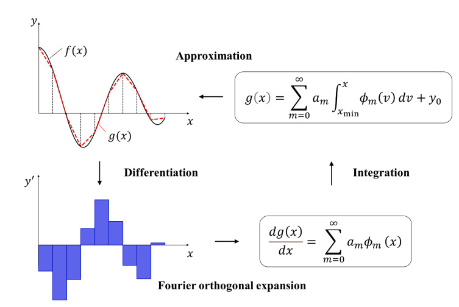

ADAF_Library
============

ADAF_Library is a Python library aimed to solve systems of ordinary differential equations (ODEs)
through physics-informed learning. Especially based on the ADA-F (Anti Derivative Approximator-Fourier series based)

- Anti-Derivative Approximator (ADA)
  - Builds the solution by modeling its derivative and reconstructing the state via integration.
- Fourier-series representation
  - Represents the derivative with a compact set of Fourier modes for stable, smooth approximation.
- Parameter-efficient representation (vs. generic PINNs)
  - Uses a structured ADA-F basis expansion so the number of trainable parameters can be kept smaller than a standard fully-connected PINN for the same time horizon.
- Hard enforcement of initial conditions
  - Supports trial-solution forms (or segment-wise anchoring) that can fix the initial condition exactly rather than only penalizing it.
- Piecewise sequential solving (ADAF_seq)
  - Splits the time domain into segments and solves them sequentially to reduce error accumulation and improve training stability.
- PINN-style residual minimization
  - Trains by minimizing ODE residuals and initial-condition mismatch without requiring paired data.

Schematic illustration of ADA-F: 

Read the following paper for more information: `S0045782524002561 <https://www.sciencedirect.com/science/article/pii/S0045782524002561>`_.

.. note::

   This project is under active development.

Contents
--------

.. toctree::
   :maxdepth: 2
   :caption: Documentation

   forward
   api
