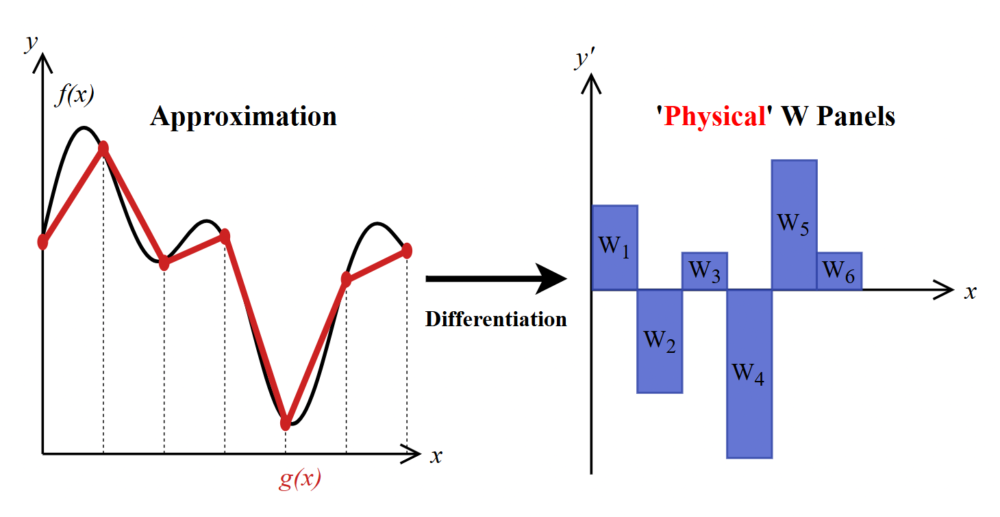

ADALib
======

ADALib is an Anti-Derivative Approximator (ADA)-based solver library for systems of ordinary differential equations (ODEs).
It approximates derivative representations using orthogonal basis functions and reconstructs state trajectories through antiderivative integration.

- Anti-Derivative Approximator (ADA)

  - Represents the derivative of each state using a compact set of trainable panel weights.
  - Reconstructs the state trajectory through antiderivative integration of the derivative representation.

- Orthogonal basis representation

  - Approximates the derivative representation using orthogonal basis functions.
  - Provides a compact and structured representation of the solution over the time domain.

- Hard enforcement of initial conditions

  - Initial conditions are naturally embedded through integration constants.
  - This allows the reconstructed trajectory to satisfy the prescribed initial condition without introducing a separate penalty term.

- Physically interpretable panel weights

  - The panel-weight coefficients represent local derivative information over the solution domain.
  - Unlike opaque latent variables in black-box neural solvers, the trainable coefficients therefore carry an explicit physical meaning.

- System-level ODE formulation

  - Users can directly define and train systems of coupled ODEs.
  - Complex neural-network architectures do not need to be implemented from scratch.

- Physics-informed training

  - The trainable panel weights are optimized by minimizing the governing ODE residuals.
  - This enables solution of ODE systems without requiring paired reference-solution data.

.. raw:: html

    

Schematic illustration of anti derivative approximation:

|

Read the following paper for more information: `"Anti-derivatives approximator for enhancing physics-informed
neural networks"  <https://www.sciencedirect.com/science/article/pii/S0045782524002561>`_

|

.. note::

   This project is under active development.

Contents
--------

.. toctree::
   :maxdepth: 2
   :caption: Documentation
   
   user_implementation
   forward
   inverse
   operator
   control
   api
